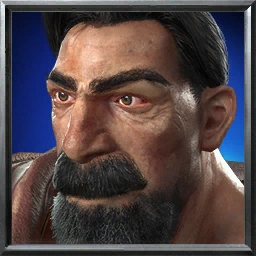

# WarClaw

<p align="center">
  
</p>

<p align="center">
  Warcraft-inspired OpenClaw client for Web, Desktop, and future Godot experiments.
</p>

## Overview

WarClaw is a game-style frontend for OpenClaw.  
The current project direction is:

- `web/`: the main active client, built with Next.js, React, Tailwind, and Electron support
- `godot/`: a scaffold for future engine-side experiments
- `doc/`: planning notes, protocol references, and asset specifications

The current Web client already includes:

- a desktop/web launch flow
- faction selection
- Warcraft III style HUD variants for `Human`, `Orc`, `Night Elf`, and `Undead`
- Electron packaging support

## Tech Stack

- `Next.js 16`
- `React 19`
- `Tailwind CSS 4`
- `Electron`
- `Three.js` for scene-side experiments
- `Godot 4.6` scaffold in the separate `godot/` directory

## Repository Layout

```text
.
├── doc/      Project plans, protocol docs, asset specs
├── godot/    Godot prototype scaffold
└── web/      Main WarClaw client
```

## Quick Start

Web and desktop development currently happen inside [`web/`](./web).

Install dependencies:

```bash
cd web
npm install
```

or:

```bash
cd web
bun install
```

Run the web client:

```bash
npm run dev
```

Run the Electron desktop client:

```bash
npm run dev:desktop
```

Build the web app:

```bash
npm run build
```

Build the desktop package:

```bash
npm run build:desktop
```

## Current Focus

The active development focus is the `web/` client:

- polish the Warcraft III inspired HUD flow
- improve race-specific presentation
- continue integrating desktop packaging and asset workflows

## Related Docs

- [`web/README.md`](./web/README.md)
- [`doc/mvp-plan.md`](./doc/mvp-plan.md)
- [`doc/tech-options.md`](./doc/tech-options.md)
- [`doc/gateway-protocol-reference.md`](./doc/gateway-protocol-reference.md)
- [`doc/pixel-asset-spec.md`](./doc/pixel-asset-spec.md)

## Status

This repository is an active prototype.  
Expect rapid iteration in UI structure, naming, and asset pipeline decisions.
